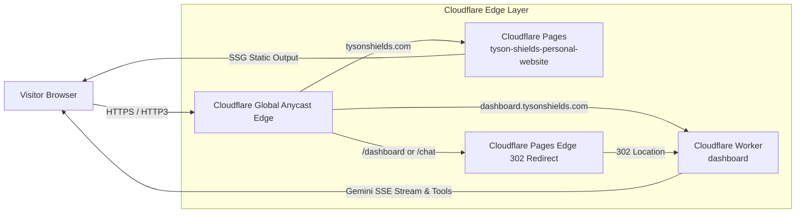

# Cloudflare Architecture & Edge Integration — tysonshields.com

This document details how Cloudflare is incorporated into **[tysonshields.com](https://tysonshields.com)** for global edge acceleration, security, automated caching, and seamless routing.

---

## 1. High-Level Architecture



---

## 2. Cloudflare Zone & Network Configuration

- **Domain / Zone:** `tysonshields.com`
- **Zone ID:** `12e36ae91a19697e3bd68f4cd362478a`
- **Account ID:** `c994b52ccc61efa3eeccb156507a5d15`
- **Assigned Nameservers:**
  - `chloe.ns.cloudflare.com`
  - `jakub.ns.cloudflare.com`
- **SSL / TLS Encryption:** Full / Strict with Universal SSL.
- **Protocols Active:**
  - **HTTP/3 (QUIC):** Ultra-fast multiplexed edge transport.
  - **0-RTT Connection Resumption:** Instantaneous TLS handshakes for returning visitors.
  - **Brotli Compression:** High-efficiency edge content compression.
  - **Early Hints (103):** Edge sends preloads for critical fonts and CSS before response generation.
  - **Auto-Minify:** Automatic edge minification of HTML, CSS, and JavaScript.

---

## 3. Edge Routing & Redirects (`_redirects`)

Cloudflare Pages natively parses the root [`_redirects`](file:///c:/Users/tyson/Documents/GitHub/Tyson-Shields-Personal-Website/_redirects) file at the edge before serving files:

```text
/dashboard      https://dashboard.tysonshields.com  302
/dashboard.html https://dashboard.tysonshields.com  302
/chat           https://dashboard.tysonshields.com  302
/chat.html      https://dashboard.tysonshields.com  302
/legacy/*       /:splat                             301
/legacy         /                                   301
```

Any attempt to visit a dashboard or chat URL on `tysonshields.com` is immediately forwarded to the dedicated Cloudflare Worker application at `dashboard.tysonshields.com`.

---

## 4. Edge Caching & Security Headers (`_headers`)

Cloudflare Pages respects the [`_headers`](file:///c:/Users/tyson/Documents/GitHub/Tyson-Shields-Personal-Website/_headers) file to instruct edge PoPs and user browsers:

| Asset Path | Browser `Cache-Control` | Cloudflare Edge `Cloudflare-CDN-Cache-Control` | Behavior |
| :--- | :--- | :--- | :--- |
| `/fonts/*` | `max-age=31536000, immutable` | `max-age=31536000` | Permanently cached across all 300+ edge data centers. |
| `/*.png`, `/*.jpg`, `/*.svg`, `/*.ico` | `max-age=2592000, immutable` | `max-age=2592000` | 30-day edge and client cache. |
| `/styles.min.css`, `/scripts/*` | `max-age=86400, stale-while-revalidate` | `max-age=604800` | 7-day edge cache with instant background revalidation. |
| `/*` (Global Security) | Strict HSTS, CSP, X-Frame-Options, X-Content-Type-Options | Handled at Edge | Defends against clickjacking, MIME sniffing, and unauthorized framing. |

---

## 5. Automation & Operational Tooling

Pre-configured Node.js utilities in `scripts/` provide immediate management:

### Check Cloudflare Infrastructure Status
Inspects active zone health, nameservers, DNS records, and Pages deployment:
```bash
npm run cf:status
```

### Instant Global Edge Cache Purge
Flushes Cloudflare's worldwide cache after publishing new content:
```bash
npm run cf:purge
```

---

## 6. Deployment Pipeline

The portfolio is continuously deployed through Cloudflare Pages:
1. Make changes to the repository.
2. Run build check: `npm run build:ssg`
3. Commit and push:
   ```bash
   git add .
   git commit -m "feat: site update"
   git push origin main
   ```
4. Cloudflare Pages automatically detects the commit on branch `main`, builds the site, and deploys globally in under 15 seconds.
5. (Optional) Run `npm run cf:purge` if you need an immediate edge purge of cached assets.
