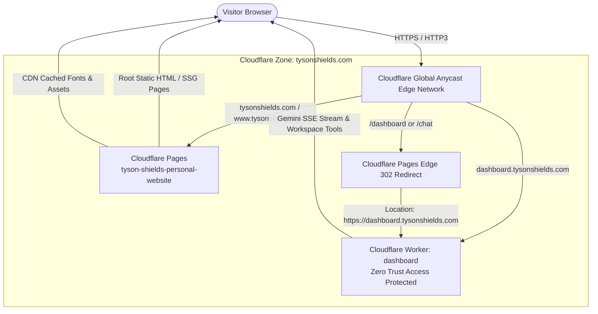

# Cloudflare Architecture & Edge Integration — tysonshields.com

This document specifies the Cloudflare infrastructure powering **[tysonshields.com](https://tysonshields.com)** for global Anycast acceleration, edge security, caching hierarchy, and seamless ecosystem routing.

---

## 1. High-Level Architecture



---

## 2. Cloudflare Zone & Network Configuration

- **Domain / Zone:** `tysonshields.com`
- **Zone ID:** `12e36ae91a19697e3bd68f4cd362478a`
- **Account ID:** `c994b52ccc61efa3eeccb156507a5d15`
- **Assigned Nameservers:**
  - `chloe.ns.cloudflare.com`
  - `jakub.ns.cloudflare.com`
- **SSL / TLS Encryption:** Full / Strict with Cloudflare Universal SSL.
- **Protocols & Acceleration Features:**
  - **HTTP/3 (QUIC):** Multiplexed edge transport reducing connection establishment latency.
  - **0-RTT Connection Resumption:** Instantaneous TLS handshakes for returning visitors.
  - **Brotli Dynamic Compression:** High-efficiency edge content compression.
  - **Early Hints (103):** Edge dispatches Link header preloads for critical typography (`Outfit`) and stylesheets before full response delivery.
  - **Auto-Minify:** Automatic edge minification for HTML, CSS, and JavaScript.

---

## 3. Edge Routing & Redirect Rules (`_redirects`)

Cloudflare Pages automatically processes the root [`_redirects`](file:///c:/Users/tyson/Documents/GitHub/Tyson-Shields-Personal-Website/_redirects) configuration file at edge PoPs before file resolution:

```text
/dashboard        https://dashboard.tysonshields.com  302
/dashboard.html   https://dashboard.tysonshields.com  302
/chat             https://dashboard.tysonshields.com  302
/chat.html        https://dashboard.tysonshields.com  302
/legacy/*         /:splat                             301
/legacy           /                                   301
```

Any attempt by a user or bookmark to access `/dashboard` or `/chat` on `tysonshields.com` is intercepted at the edge and forwarded to the specialized Cloudflare Worker application running at `dashboard.tysonshields.com`.

---

## 4. Edge Caching & Security Headers (`_headers`)

Cloudflare Pages evaluates the [`_headers`](file:///c:/Users/tyson/Documents/GitHub/Tyson-Shields-Personal-Website/_headers) file to instruct edge data centers and client browsers:

| Asset Path | Browser `Cache-Control` | Cloudflare Edge `Cloudflare-CDN-Cache-Control` | Behavior & Purpose |
| :--- | :--- | :--- | :--- |
| `/fonts/*` | `max-age=31536000, immutable` | `max-age=31536000` | Permanently cached across all 300+ global edge data centers. |
| `/*.png`, `/*.jpg`, `/*.svg`, `/*.ico` | `max-age=2592000, immutable` | `max-age=2592000` | 30-day edge and client cache for headshots, favicons, and social cards. |
| `/styles.min.css`, `/scripts/*` | `max-age=86400, stale-while-revalidate` | `max-age=604800` | 7-day edge cache with instant background revalidation. |
| `/*` (Global Security) | HSTS, CSP, X-Frame-Options, X-Content-Type-Options | Handled at Edge | Defends against clickjacking, MIME sniffing, and unauthorized frame embedding. |

### Global Security Headers Applied:
```http
/*
  X-Frame-Options: SAMEORIGIN
  X-Content-Type-Options: nosniff
  Referrer-Policy: strict-origin-when-cross-origin
  Permissions-Policy: accelerometer=(), camera=(), geolocation=(), gyroscope=(), magnetometer=(), microphone=(), payment=(), usb=()
  Strict-Transport-Security: max-age=31536000; includeSubDomains; preload
```

---

## 5. Automation & Operational Tooling

The repository provides Node.js scripts in `scripts/` to interact with Cloudflare via CLI:

### 1. Check Cloudflare Infrastructure Telemetry
```bash
npm run cf:status
```
Runs [`scripts/cf-status.js`](file:///c:/Users/tyson/Documents/GitHub/Tyson-Shields-Personal-Website/scripts/cf-status.js) to inspect zone status, active nameservers, DNS routing records, and Cloudflare Pages deployment health.

### 2. Instant Global Edge Cache Invalidation
```bash
npm run cf:purge
```
Runs [`scripts/cf-purge.js`](file:///c:/Users/tyson/Documents/GitHub/Tyson-Shields-Personal-Website/scripts/cf-purge.js) to issue a purge-everything request to the Cloudflare API, ensuring newly published content is served across all 300+ PoPs immediately.

---

## 6. Continuous Deployment Workflow

The portfolio is continuously deployed through Cloudflare Pages Git integration:
1. Make code or styling changes.
2. Recompile production styles: `npm run build`
3. Validate static output: `npm run build:ssg`
4. Commit and push:
   ```bash
   git add .
   git commit -m "feat: publish updated content"
   git push origin main
   ```
5. Cloudflare Pages automatically detects the push to `main`, executes the build command, and deploys globally in under 15 seconds.
6. (Optional) Run `npm run cf:purge` if an immediate edge purge of cached assets is needed.
