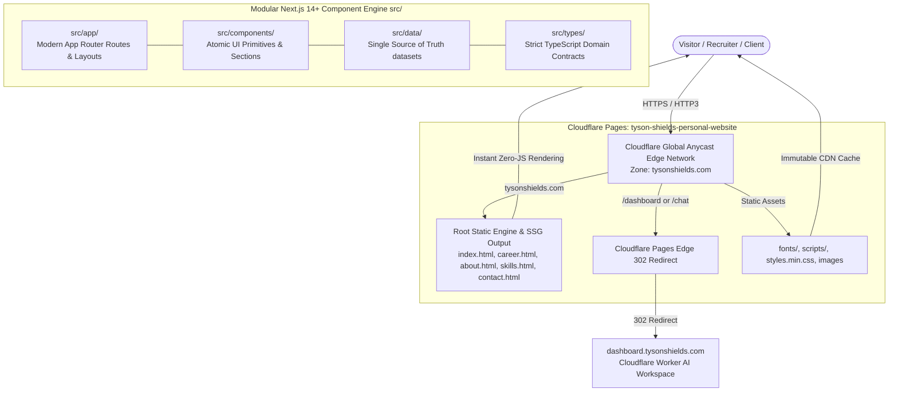

# Tyson Shields Portfolio & Technical Systems

[](package.json)
[](LICENSE)
[](https://pages.cloudflare.com)
[](.eleventy.js)
[](tsconfig.json)
[](tailwind.config.ts)

The professional portfolio and technical platform of **Tyson Shields**—Business Analyst specializing in **Employee Benefits**, licensed Life & Health Insurance Producer (State of Nebraska #21707104), and systems engineer.

---

## 🏛 System Architecture

The repository employs a **dual architectural structure** designed for maximum performance, rock-solid stability, and forward-looking component modularity:



1. **Production Static Delivery (Root):** High-speed, zero-dependency static pages (`index.html`, `about.html`, `career.html`, `skills.html`, `contact.html`, `Tyson-Shields-Resume.html`, `Tyson-Shields-Resume.pdf`) compiled with esbuild (`styles.min.css`), local Outfit typography, and vanilla progressive enhancement (`scripts/core.js`). Deployed globally via Cloudflare Pages.
2. **Modular Next.js / TypeScript App Engine (`src/`):** Strongly typed, component-driven application layer utilizing the Next.js 14+ App Router (`src/app/`), atomic design tokens, centralized single-source-of-truth data arrays (`src/data/`), domain models (`src/types/`), and path aliases (`@/*`).

---

## 📂 Directory Layout

```text
Tyson-Shields-Personal-Website/
├── docs/                             # Architecture blueprints & AI agent instructions
│   ├── AGENT_GUIDELINES.md           # Comprehensive manual for AI models & developers
│   └── ARCHITECTURE.md               # High-level system architecture overview
├── _includes/                        # Eleventy reusable partials (header, footer, drawer)
├── _layouts/                         # Base HTML layouts for static generation
├── fonts/                            # Modern WOFF2 typography (Outfit)
├── scripts/                          # Client-side scripts and Cloudflare CLI tooling
│   ├── core.js                       # Shared UI preferences, theme engine, navigation
│   ├── home.js                       # Interactive homepage particle effects & timeline
│   ├── contact.js                    # Direct contact modal and clipboard interactions
│   ├── 404.js                        # Dynamic route recovery & suggestion engine
│   ├── cf-status.js                  # Cloudflare zone, DNS, and Pages health verifier
│   └── cf-purge.js                   # Instant worldwide edge cache invalidator
├── src/                              # Next.js App Router & Component Engine
│   ├── app/                          # Next.js pages, layouts, and global CSS
│   ├── components/                   # Component design system (ui, sections, layout)
│   ├── data/                         # Centralized Single Source of Truth datasets
│   ├── lib/                          # Utility functions & Schema.org JSON-LD builders
│   ├── styles/                       # Source stylesheet definitions
│   └── types/                        # Strict domain contracts & TypeScript interfaces
├── .eleventy.js                      # Eleventy SSG configuration and passthrough rules
├── .eleventyignore                   # Exclusions for Eleventy static build
├── .gitignore                        # Git ignore rules
├── _headers                          # Cloudflare Pages edge HTTP security and caching headers
├── _redirects                        # Cloudflare Pages edge 302/301 routing rules
├── 404.html                          # Not Found page
├── about.html                        # About / Executive Dossier
├── career.html                       # Career Chronology & Published Columns
├── contact.html                      # Comms Relay & Direct Contact
├── index.html                        # Production Homepage (tysonshields.com)
├── skills.html                       # Technical Competencies Matrix & Certifications
├── Tyson-Shields-Resume.html         # Web-viewable interactive resume
├── Tyson-Shields-Resume.pdf          # Downloadable PDF resume artifact
├── styles.css                        # Source cybernetic CSS stylesheet
├── styles.min.css                    # Minified production stylesheet (compiled by esbuild)
├── favicon.ico & favicon-*.png       # Multi-resolution favicons
├── headshot.jpg & og-image.png       # Headshot & social preview cards
├── site.webmanifest                  # Progressive Web App manifest
├── sitemap.xml & robots.txt          # SEO crawlers and index directives
├── package.json                      # Build scripts and project dependencies
├── tailwind.config.ts                # Tailwind design tokens & font configuration
├── tsconfig.json                     # Strict TypeScript configuration with @/* aliases
└── vercel.json                       # Deployment routing, clean URLs & security headers
```

---

## ⚡ Core Domain Specializations

- **Employee Benefits & Plan Modeling:** Self-funded stop-loss corridors, specific and aggregate attachment points, level-funded risk tiers, fully insured rate renewals, deductible modeling, and contribution strategies.
- **Census Data Engineering & Systems:** EDI 834 benefit enrollment feeds, high-volume census normalization, carrier billing reconciliation, and data parity audits.
- **Process Automation:** Transforming carrier RFP intake matrices into board-ready executive renewal presentations, compressing cycle times by 40%.
- **Broadcast & Live Media Systems:** Video routing, Dante audio networking, SMPTE 2110 IP video infrastructure, and live multi-camera broadcast switching.

---

## 🛠 Local Development & Operational Commands

All development tasks are automated through npm scripts:

### 1. Minify Production CSS
```bash
npm run build
# Compiles styles.css -> styles.min.css via esbuild in ~15ms
```

### 2. Full Static Site Generator Build (Eleventy)
```bash
npm run build:ssg
# Minifies CSS with esbuild and builds static site into _site/ via @11ty/eleventy
```

### 3. Local Live-Reload Dev Server
```bash
npm run dev
# Starts Eleventy dev server with hot-reload at http://localhost:8080
```

### 4. Static HTTP Preview Server
```bash
npm run preview
# Serves root files directly at http://localhost:8000
```

### 5. Cloudflare Edge Status & Diagnostics
```bash
npm run cf:status
# Inspects real-time Cloudflare zone, DNS routing, and Pages deployment health
```

### 6. Cloudflare Global Edge Cache Purge
```bash
npm run cf:purge
# Triggers instant global cache invalidation across all 300+ Cloudflare PoPs
```

For full details on edge caching, security headers, and DNS topology, see **[`CLOUDFLARE.md`](CLOUDFLARE.md)**.

---

## ☁️ Cloudflare Edge & Ecosystem Integration

- **Production Domain:** `https://tysonshields.com` (Cloudflare Pages)
- **AI Workspace:** `https://dashboard.tysonshields.com` (Cloudflare Worker `dashboard` with Zero Trust Access)
- **Edge Routing & Forwarding:**
  - `_redirects` forwards `/dashboard` and `/chat` directly to `https://dashboard.tysonshields.com`.
  - `_headers` enforces HTTP/3, TLS 1.3 0-RTT, and immutable Cloudflare CDN caching for fonts, images, and minified assets.
  - Automatic minification active at the Cloudflare edge for HTML, CSS, and JS.

---

## 📖 Contributing & AI Agent Instructions

All engineers and automated AI coding assistants **must adhere** to the architectural specifications and content workflows detailed in **[`docs/AGENT_GUIDELINES.md`](docs/AGENT_GUIDELINES.md)**.

### Content Update Rules:
1. **Never modify presentation markup directly** to add credentials, articles, or experience.
2. **Update data layers** in `src/data/` (`credentials.ts`, `articles.ts`, `experience.ts`, `socials.ts`) using the strongly typed contracts defined in `src/types/`.
3. **Always run `npm run build`** after editing `styles.css` to regenerate `styles.min.css`.
4. **Preserve SEO JSON-LD schema** integrity across all page headers.

---

## 📄 License & Attribution

- Designed and engineered by **Tyson Shields**.
- Code licensed under the [MIT License](LICENSE).
