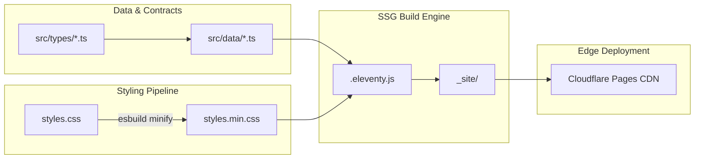

# Project Architecture & Modular Design

## Overview
This repository hosts the professional portfolio of **Tyson Shields**, engineered with a **dual architectural structure**:
1. **Production Static Delivery (Root):** Zero-JS-dependent, high-speed static HTML pages (`index.html`, `career.html`, `about.html`, `skills.html`, `contact.html`, `Tyson-Shields-Resume.html`, `Tyson-Shields-Resume.pdf`), compiled minified CSS (`styles.min.css`), local Outfit typography, and Eleventy static site generation (`.eleventy.js`).
2. **Modular Next.js 14+ Component Engine (`src/`):** Strongly typed, component-driven architecture using Next.js App Router, TypeScript, Tailwind CSS, centralized data layers, and domain contracts.

---

## Directory Hierarchy

```text
Tyson-Shields-Personal-Website/
├── docs/                           # Architecture guides & AI agent instructions
│   ├── AGENT_GUIDELINES.md         # Comprehensive AI agent & developer workflow manual
│   └── ARCHITECTURE.md             # This high-level system architecture overview
├── _includes/                      # Reusable Eleventy partials (header, footer, drawer)
├── _layouts/                       # Eleventy base layouts
├── fonts/                          # Modern WOFF2 typography (Outfit)
├── scripts/                        # Progressive enhancement scripts & Cloudflare tooling
│   ├── core.js                     # Shared preferences, theme engine, navigation
│   ├── home.js                     # Homepage particle canvas & timeline
│   ├── contact.js                  # Contact relay & clipboard utilities
│   ├── 404.js                      # Route recovery helper
│   ├── cf-status.js                # Cloudflare zone & DNS verifier
│   └── cf-purge.js                 # Global CDN cache purger
├── src/                            # Modern Next.js App Router Application
│   ├── app/                        # App Router routes, layouts, and globals.css
│   ├── components/                 # Component library (ui primitives, sections, layout)
│   ├── data/                       # Centralized Single Source of Truth datasets
│   ├── lib/                        # Utility functions & Schema.org generators
│   ├── styles/                     # Source styles & design system tokens
│   └── types/                      # Shared TypeScript domain contracts
├── .eleventy.js                    # Eleventy SSG configuration
├── .eleventyignore                 # Eleventy build exclusions
├── _headers                        # Cloudflare Pages edge HTTP security and caching headers
├── _redirects                      # Cloudflare Pages edge 302/301 routing rules
├── 404.html                        # Not Found error page
├── about.html                      # Executive Dossier & Biography
├── career.html                     # Career Chronology & Published Columns
├── contact.html                    # Direct Communication Relay
├── index.html                      # Production Homepage (tysonshields.com)
├── skills.html                     # Technical Competencies Matrix & Certifications
├── Tyson-Shields-Resume.html       # Web-viewable interactive resume
├── Tyson-Shields-Resume.pdf        # Downloadable PDF resume artifact
├── styles.css                      # Source cybernetic CSS stylesheet
├── styles.min.css                  # Production minified stylesheet (esbuild)
├── package.json                    # Build scripts & dependency declarations
├── tailwind.config.ts              # Tailwind design tokens & font configuration
├── tsconfig.json                   # Strict TypeScript configuration with @/* aliases
└── vercel.json                     # Fallback routing, clean URLs & security headers
```

---

## Separation of Concerns

1. **Presentation Layer (`src/components/` & Root HTML):** Pure UI components and pre-rendered semantic HTML consuming structured data without hardcoded logic.
2. **Domain Data Layer (`src/data/`):** All content (credentials, published columns, experience milestones, contact relays) lives here as strongly typed arrays.
3. **Contracts Layer (`src/types/`):** TypeScript interfaces defining the shape of domain entities (`Credential`, `Article`, `ExperienceItem`, `SocialLink`).
4. **Edge Delivery Layer (`_headers` & `_redirects`):** Native Cloudflare Pages rules governing HTTP/3 transport, immutable font/image caching, security policies, and 302 forwarding of `/dashboard` and `/chat` to `https://dashboard.tysonshields.com`.

---

## Data Flow & Build Pipeline


