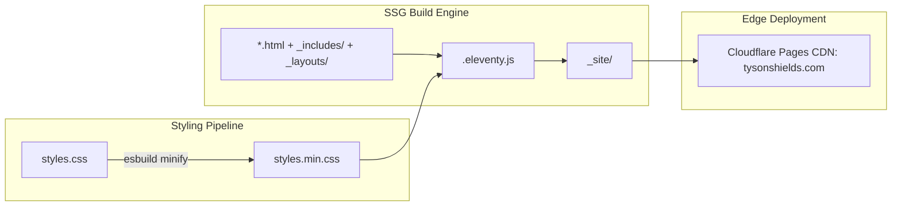

# Project Architecture & Systems Blueprint

## Overview
This repository hosts the professional portfolio of **Tyson Shields**, engineered with a high-performance **static delivery architecture**:
1. **Production Static Delivery (Root):** Zero-JS-dependent, high-speed semantic HTML5 pages (`index.html`, `career.html`, `about.html`, `skills.html`, `contact.html`, `Tyson-Shields-Resume.html`, `Tyson-Shields-Resume.pdf`), compiled minified CSS (`styles.min.css`), local Outfit typography, and Eleventy static site generation (`.eleventy.js`).
2. **Global Edge Delivery (Cloudflare Pages):** Full Anycast distribution, edge redirects forwarding `/dashboard` and `/chat` to `https://dashboard.tysonshields.com`, and immutable CDN caching headers.

---

## Directory Hierarchy

```text
Tyson-Shields-Personal-Website/
├── docs/                           # Architecture guides & engineering manuals
│   ├── AGENT_GUIDELINES.md         # Guidelines for AI models & software engineers
│   └── ARCHITECTURE.md             # This high-level systems architecture overview
├── _includes/                      # Reusable Eleventy partials (header, footer, drawer)
├── _layouts/                       # Eleventy base HTML layouts
├── fonts/                          # Modern WOFF2 typography (Outfit Latin 400 & 700)
├── scripts/                        # Progressive enhancement scripts & Cloudflare tooling
│   ├── core.js                     # Shared preferences, theme engine, navigation
│   ├── home.js                     # Homepage particle canvas & timeline
│   ├── contact.js                  # Contact relay & clipboard utilities
│   ├── 404.js                      # Route recovery helper
│   ├── cf-status.js                # Cloudflare zone & DNS verifier
│   └── cf-purge.js                 # Global CDN cache purger
├── .eleventy.js                    # Eleventy SSG configuration
├── .eleventyignore                 # Eleventy build exclusions
├── _headers                        # Cloudflare Pages edge HTTP security and caching headers
├── _redirects                      # Cloudflare Pages edge 302/301 routing rules
├── 404.html                        # Not Found error page
├── about.html                      # Executive Dossier & Biography
├── career.html                     # Career Chronology & Published Columns
├── contact.html                    # Direct Communication Relay
├── index.html                      # Production Homepage (tysonshields.com)
├── skills.html                     # Technical Competencies Matrix & Certifications
├── Tyson-Shields-Resume.html       # Web-viewable interactive resume
├── Tyson-Shields-Resume.pdf        # Downloadable PDF resume artifact
├── styles.css                      # Source cybernetic CSS stylesheet
├── styles.min.css                  # Production minified stylesheet (esbuild)
├── tyson-shields-headshot.jpg      # High-resolution executive headshot
├── og-image.png                    # Social preview OpenGraph card
├── favicon.ico & favicon-*.png     # Multi-resolution favicons
├── site.webmanifest                # Progressive Web App manifest
├── sitemap.xml & robots.txt        # SEO crawlers and index directives
└── package.json                    # Build scripts & dependency declarations
```

---

## Separation of Concerns

1. **Semantic Content Layer (`*.html`):** Pre-rendered semantic HTML containing structured text, Schema.org JSON-LD metadata, and accessibility landmarks.
2. **Templating Engine (`_includes/` & `_layouts/`):** Reusable partials for header, footer, and navigation managed via Eleventy 3.x.
3. **Styling Pipeline (`styles.css` $\rightarrow$ `styles.min.css`):** Source CSS custom properties compiled and minified in ~15ms via `esbuild`.
4. **Progressive Enhancement (`scripts/`):** Lightweight client scripts for theme toggling, particle effects, and copy interactions with zero framework dependencies.
5. **Edge Delivery Layer (`_headers` & `_redirects`):** Native Cloudflare Pages rules governing HTTP/3 transport, immutable font/image caching, security policies, and 302 forwarding of `/dashboard` and `/chat` to `https://dashboard.tysonshields.com`.

---

## Data Flow & Build Pipeline


